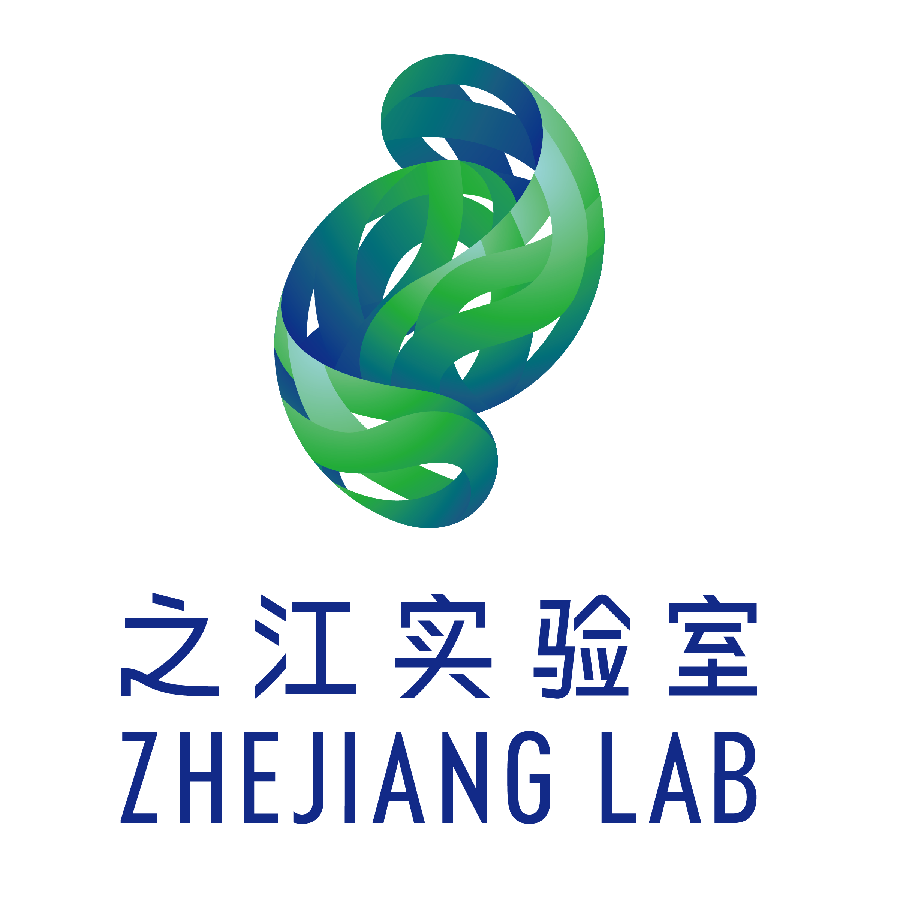

  <!-- knock code pictures 敲代码的图片 -->
   

  <!-- dynamic typing effect 动态打字效果 -->
  

   <!-- statistics on the number of visits 访问数统计 -->
  
  
  <!-- Snake Code Contribution Map 贪吃蛇代码贡献图 -->
  <picture>
    <source media="(prefers-color-scheme: dark)" srcset="https://cdn.jsdelivr.net/gh/sun0225SUN/sun0225SUN/profile-snake-contrib/github-contribution-grid-snake-dark.svg" />
    <source media="(prefers-color-scheme: light)" srcset="https://cdn.jsdelivr.net/gh/sun0225SUN/sun0225SUN/profile-snake-contrib/github-contribution-grid-snake.svg" />
    
  </picture>

<!-- About me 关于我 -->
# 💬 About Me

<table>
<tr><td>

&emsp;&emsp;Hey, My name is <b>Huang Niyuan</b>, an undergraduate student from <b>Zhejiang University</b> in China.

&emsp;&emsp;I majored in <b>Finance</b> and minored in <b>Artificial Intelligence</b>.

&emsp;&emsp;Passionate about finance and computer science, constantly exploring the interdisciplinary field of finance and computer.

&emsp;&emsp;Aspiring to devote myself to the economic and financial industry, using code to contribute to modern finance.

</td></tr>

<tr>
<td>
  
### ✏ Educational Background

- [Zhejiang University](https://www.zju.edu.cn/) &emsp; 📌 2021.09 —— Now
    
  - Major: Fiance
  - Minor: Artificial Intelligence

<tr><td>
  
### 💼 Work Experience

- [New Momentum Asset Management](http://www.newmomentum.cn/) &emsp; 📌 2023-07-3 —— Now
  
  - Job Position: Quantitative Researcher in the Strategy Department with a focus on Factor Analysis
  - Job Responsibilities: Responsible for the exploration, enhancement, and research of price-volume factors and fundamental factors, primarily involving structured data in mid-to-low dimensions.

- [Zhejiang Lab](https://www.zhejianglab.com/home) &emsp; 📌 2022-01-21 —— 2023-07-21
  
  - Job Position: Financial Technology Center Intern
  - Job Responsibilities: Participated in research on financial technology-related topics, studying the current status, achievements, and challenges of financial technology in China. My main responsibilities included data processing and data analysis.

- [Alibaba](https://www.alibabagroup.com/zh-HK) &emsp; 📌 2021-08-02 —— 2021-08-13
  
  - Job Position: Alibaba Group - CPO Line - Human Resources Department - Global Talent Pool - Employer Branding
  - Job Responsibilities: Participated in human resources-related work, gaining insights into the business models of the internet industry represented by Taobao, Fliggy, and Ant Financial.

</td></tr>

<tr><td>

### 📝  Research Experience

- Network and Rational Inattention &emsp; 📌 2023-01-05 —— now
  
  - Research Progress: Still working. A proof of the existence of solutions for the fixed-point equation has been accepted by the supervisor.
  - Research Content: The main work involves proving the existence and uniqueness of solutions to fixed-point equations in the model, applying Brouwer's Fixed Point Theorem, Kellogg's Theorem on Uniqueness, and Matrix Differential Calculus, as well as utilizing numerical solutions with MATLAB.

- [ESG Rating Events, Financial Investment Behavior and Corporate Innovation](https://www.sciencedirect.com/science/article/abs/pii/S0313592622001977) &emsp; 📌 2021-08-02 —— 2021-08-13
  
  - Research Progress: The paper was successfully published in "Analyses of Topical Policy Issues".
  - Research Content: Taking Chinese A-share non-financial listed companies from 2009 to 2020 as research samples, this paper empirically studies the mechanism of ESG rating events affecting corporate innovation of listed companies.

</td></tr>

<tr><td>

<!-- wakatime 统计 -->
### 📊 WakaTime

<picture>
  <source
    srcset="https://github-readme-stats.vercel.app/api/wakatime?username=HUANG-NI-YUAN&layout=compact&text_color=f0f6fc&bg_color=00000000&hide_border=true&hide_title=true"
    media="(prefers-color-scheme: dark)"
  />
  <source
    srcset="https://github-readme-stats.vercel.app/api/wakatime?username=HUANG-NI-YUAN&layout=compact&text_color=1f2328&bg_color=00000000&hide_border=true&hide_title=true"
    media="(prefers-color-scheme: light), (prefers-color-scheme: no-preference)"
  />
  
</picture>

</td></tr>

</table>

<!-- wakatime 统计 -->

# 📊 Statistics

<table>
<tr><td>
    
### ⌨ Language
  - Language: Python, C, MATLAB, States
  - Program: Pytorch, sklearn

    

    
      

</td></tr>
<tr><td>
  
### 📈 GitHub Statistics

</td></tr>

<tr>
<td>
  
### 📊 GitHub streak

</td>
</tr>

<tr><td>
  
### 📋 Metrics

</td></tr>

<!-- GitHub Activity Graph GitHub 活动图 -->
<tr><td>
  
### 📋 activity-graph

</td></tr>

</table>

<!--
**HUANG-NI-YUAN/HUANG-NI-YUAN** is a ✨ _special_ ✨ repository because its `README.md` (this file) appears on your GitHub profile.

Here are some ideas to get you started:

- 🔭 I’m currently working on ...
- 🌱 I’m currently learning ...
- 👯 I’m looking to collaborate on ...
- 🤔 I’m looking for help with ...
- 💬 Ask me about ...
- 📫 How to reach me: ...
- 😄 Pronouns: ...
- ⚡ Fun fact: ...
-->
