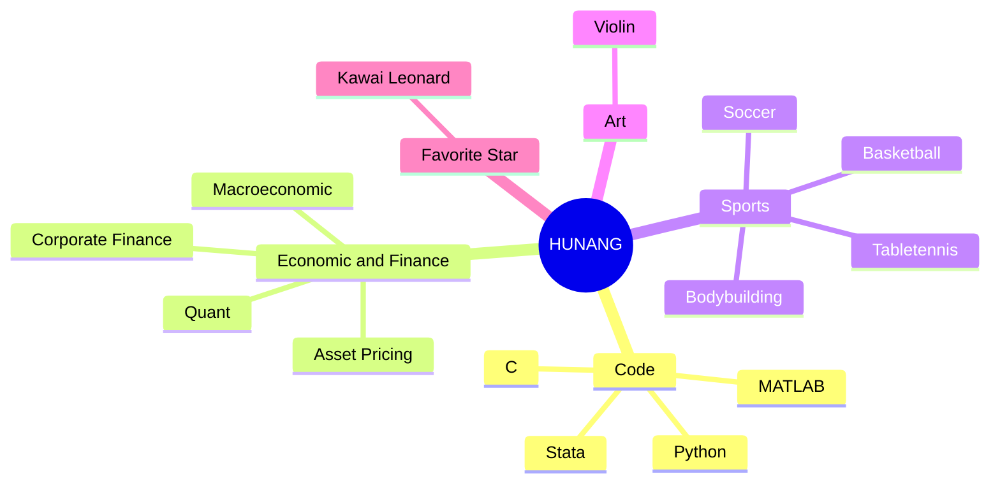

<div align="center">

  <!-- knock code pictures 敲代码的图片 -->
  <br>

  <!-- dynamic typing effect 动态打字效果 -->
  [](https://git.io/typing-svg)

   <!-- statistics on the number of visits 访问数统计 -->
  
  
  <!-- Snake Code Contribution Map 贪吃蛇代码贡献图 -->
  <picture>
    <source media="(prefers-color-scheme: dark)" srcset="https://cdn.jsdelivr.net/gh/HUANG-NI-YUAN/HUANG-NI-YUAN/profile-snake-contrib/github-contribution-grid-snake-dark.svg" />
    <source media="(prefers-color-scheme: light)" srcset="https://cdn.jsdelivr.net/gh/HUANG-NI-YUAN/HUANG-NI-YUAN/profile-snake-contrib/github-contribution-grid-snake.svg" />
    
  </picture>

</div>

#  🙋 Hello

<table>
<tr><td>

<!-- About me 关于我 -->
### 💬 About Me


<p>&emsp;&emsp;Hey, My name is <b>Niyuan Huang</b>, an undergraduate student from <b>Zhejiang University</b> in China.</p>
<p>&emsp;&emsp;I majored in <b>Finance</b> and minored in <b>Artificial Intelligence</b>.</p>
<p>&emsp;&emsp;Passionate about finance and computer science, constantly exploring the interdisciplinary field of finance and computer.</p>
<p>&emsp;&emsp;Aspiring to devote myself to the economic and financial industry, using code to contribute to modern finance.</p>

</td></tr>

<tr>
<td>

<!-- Educational Background 教育经历 -->
### ✏ Educational Background


- [Zhejiang University](https://www.zju.edu.cn/) &emsp; 📌 2021.09 —— Now
    
  - Major: Fiance
  - Minor: Artificial Intelligence

</td></tr>

<tr><td>

<!-- Work Experience 实习经历 -->
### 💼 Work Experience


- [New Momentum Asset Management](http://www.newmomentum.cn/) &emsp; 📌 2023-07-3 —— Now
  
  - Job Position: Quantitative Researcher in the Strategy Department with a focus on Factor Analysis
  - Job Responsibilities: Responsible for the exploration, enhancement, and research of price-volume factors and fundamental factors, primarily involving structured data in mid-to-low dimensions.


- [Zhejiang Lab](https://www.zhejianglab.com/home) &emsp; 📌 2022-01-21 —— 2023-07-21
  
  - Job Position: Financial Technology Center Intern
  - Job Responsibilities: Participated in research on financial technology-related topics, studying the current status, achievements, and challenges of financial technology in China. My main responsibilities included data processing and data analysis.


- [Alibaba](https://www.alibabagroup.com/zh-HK) &emsp; 📌 2021-08-02 —— 2021-08-13
  
  - Job Position: Alibaba Group - CPO Line - Human Resources Department - Global Talent Pool - Employer Branding
  - Job Responsibilities: Participated in human resources-related work, gaining insights into the business models of the internet industry represented by Taobao, Fliggy, and Ant Financial.

</td></tr>

<tr><td>

<!-- Research Experience 科研经历 -->
### 📝  Research Experience

- Network and Rational Inattention &emsp; 📌 2023-01-05 —— now
  
  - Research Progress: Still working. A proof of the existence of solutions for the fixed-point equation has been accepted by the supervisor.
  - Research Content: The main work involves proving the existence and uniqueness of solutions to fixed-point equations in the model, applying Brouwer's Fixed Point Theorem, Kellogg's Theorem on Uniqueness, and Matrix Differential Calculus, as well as utilizing numerical solutions with MATLAB.


- [ESG Rating Events, Financial Investment Behavior and Corporate Innovation](https://www.sciencedirect.com/science/article/abs/pii/S0313592622001977) &emsp; 📌 2021-08-02 —— 2021-08-13
  
  - Research Progress: The paper was successfully published in "Analyses of Topical Policy Issues".
  - Research Content: Taking Chinese A-share non-financial listed companies from 2009 to 2020 as research samples, this paper empirically studies the mechanism of ESG rating events affecting corporate innovation of listed companies.

</td></tr>

<tr><td>

<!-- wakatime 统计 -->
### 📊 WakaTime

<picture>
  <source
    srcset="https://github-readme-stats.vercel.app/api/wakatime?username=HUANG_NI_YUAN&layout=compact&text_color=f0f6fc&bg_color=00000000&hide_border=true&hide_title=true"
    media="(prefers-color-scheme: dark)"
  />
  <source
    srcset="https://github-readme-stats.vercel.app/api/wakatime?username=HUANG_NI_YUAN&layout=compact&text_color=1f2328&bg_color=00000000&hide_border=true&hide_title=true"
    media="(prefers-color-scheme: light), (prefers-color-scheme: no-preference)"
  />
  
</picture>

<!--START_SECTION:waka-->
**I'm an Early 🐤** 

```text
🌞 Morning                9 commits           ███░░░░░░░░░░░░░░░░░░░░░░   10.71 % 
🌆 Daytime                69 commits          █████████████████████░░░░   82.14 % 
🌃 Evening                5 commits           █░░░░░░░░░░░░░░░░░░░░░░░░   05.95 % 
🌙 Night                  1 commits           ░░░░░░░░░░░░░░░░░░░░░░░░░   01.19 % 
```
📅 **I'm Most Productive on Wednesday** 

```text
Monday                   0 commits           ░░░░░░░░░░░░░░░░░░░░░░░░░   00.00 % 
Tuesday                  18 commits          █████░░░░░░░░░░░░░░░░░░░░   21.43 % 
Wednesday                25 commits          ███████░░░░░░░░░░░░░░░░░░   29.76 % 
Thursday                 16 commits          █████░░░░░░░░░░░░░░░░░░░░   19.05 % 
Friday                   8 commits           ██░░░░░░░░░░░░░░░░░░░░░░░   09.52 % 
Saturday                 17 commits          █████░░░░░░░░░░░░░░░░░░░░   20.24 % 
Sunday                   0 commits           ░░░░░░░░░░░░░░░░░░░░░░░░░   00.00 % 
```


📊 **This Week I Spent My Time On** 

```text
🕑︎ Time Zone: Asia/Shanghai

💬 Programming Languages: 
Python                   2 hrs 10 mins       ████████████████████████░   96.08 % 
Text                     3 mins              █░░░░░░░░░░░░░░░░░░░░░░░░   02.89 % 
Other                    1 min               ░░░░░░░░░░░░░░░░░░░░░░░░░   01.03 % 

🔥 Editors: 
VS Code                  2 hrs 16 mins       █████████████████████████   100.00 % 

💻 Operating System: 
Windows                  2 hrs 16 mins       █████████████████████████   100.00 % 
```


 Last Updated on 07/11/2023 00:50:53 UTC
<!--END_SECTION:waka-->

</td></tr>
</table>
<!-- ########################################## 分割 ########################################## -->


# More about me

<div align="center" >



<!-- just img 图片 -->
</div>

<!-- ########################################## 分割 ########################################## -->


<div align="center">

<!-- run 图片 -->


<!-- Joke 笑话 -->
<div></div>

<!-- Metrics 基础资料 -->
&emsp;

&emsp;

<!-- GitHub Stats Card 统计小卡片 -->
&emsp;

&emsp;

<!-- Most used languages 使用语言统计 -->
&emsp;

&emsp;

<!-- github-readme-streak-stats 连续提交代码天数记录 -->
&emsp;

&emsp;

<!-- GitHub Activity Graph GitHub 活动图 -->
#### hello
<table align="center">
  <tr><td></td></tr>
  <tr>
    <td></td>
  </tr>
  <tr>
    <td></td>
  </tr>
  <tr>
    <td></td>
  </tr>
  <tr>
    <td></td>
  </tr>
</table>

</div>


<!-- ########################################## 分割 ########################################## -->


<!-- GitHub metrics 信息指标 -->
<div align="center">

<!-- first form 第一个表格 -->
<table>
  <tr>
    <td></td>
  </tr>
</table>

<!-- second form 第二个表格 -->
<table>
  <tr>
    <td></td>
    <td></td>
  </tr>
  <tr>
    <td></td>
    <td></td>
  </tr>
  <tr>
    <td></td>
    <td></td>
  </tr>
  <tr>
    <td></td>
    <td></td>
  </tr>
  <tr>
    <td></td>
    <td></td>
  </tr>
  <tr>
    <td></td>
    <td></td>
  </tr>
</table>

</div>


